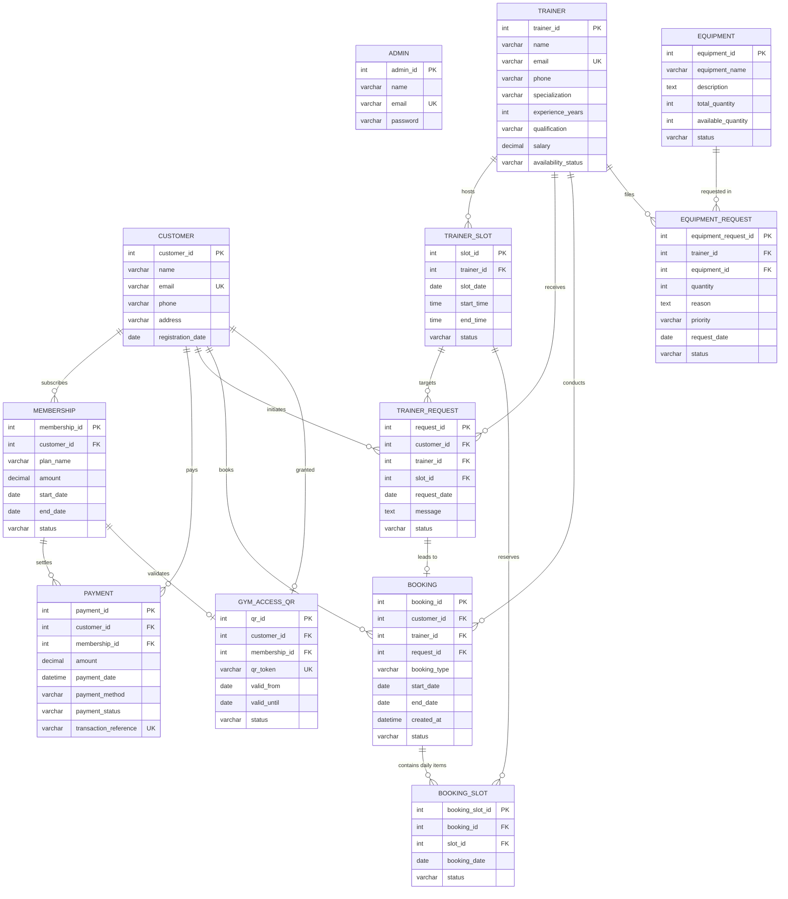

# 🏋️ Gym Management System (DBMS Mini-Project)

A complete, production-grade, role-based **Gym Management System** built specifically for **DBMS (Database Management Systems)** university coursework and viva examinations.

The system is backed by **MySQL 8.0**, powered by **Java 21 & Spring Boot 3.3.4 (Spring Data JPA / Hibernate)**, and delivers a sleek, responsive **HTML5/CSS3/JavaScript** user interface that connects directly to the database.

---

## 📑 Table of Contents
1. [Project Overview](#-project-overview)
2. [Technology Stack](#-technology-stack)
3. [Database Schema (12 Tables & ER Design)](#-database-schema-12-tables)
4. [Default Login Credentials](#-default-login-credentials)
5. [Step-by-Step Setup & Execution Instructions](#-step-by-step-setup--execution-instructions)
6. [DBMS Demonstration Flow for Viva](#-dbms-demonstration-flow-for-viva)
7. [Comprehensive SQL Demonstration Queries](#-comprehensive-sql-demonstration-queries)
8. [Key DBMS Concepts Demonstrated](#-key-dbms-concepts-demonstrated)

---

## 🌟 Project Overview

The **Gym Management System** manages complete operational lifecycles for fitness centers with three distinct roles:
1. **Admin:** Oversees trainer salaries & profiles, customer membership tenures, master schedules, equipment inventory, and reviews equipment requisitions.
2. **Trainer:** Manages personal daily schedules, reviews/accepts/rejects customer coaching requests, views assigned clients, and files equipment requisitions to Admin.
3. **Customer:** Manages gym memberships, conducts simulated fee payments via an atomic DBMS transaction, unlocks verified QR access codes, browses trainers, and books sessions in either **ONE DAY** or **DAILY recurring** mode with concurrency double-booking prevention.
4. **Turnstile Gate Simulator:** A dedicated digital hardware gate validator that inspects QR tokens in real-time, verifying token existence, token activity, membership active status, and date range validity before granting entry (`ACCESS GRANTED` vs `ACCESS DENIED`).

---

## 🛠 Technology Stack

| Layer | Technology | Details |
| :--- | :--- | :--- |
| **Database** | MySQL 8.0+ | InnoDB storage engine, foreign key constraints, checks, indexes |
| **Backend** | Java 21 / Spring Boot 3.3.4 | Spring Web REST API, Spring Data JPA, Hibernate ORM |
| **Build Tool** | Apache Maven | Maven Wrapper (`mvnw.cmd` / `mvnw`) included |
| **Frontend** | HTML5, CSS3, JavaScript | Responsive CSS grid/flexbox, SVG QR renderer, no Node.js required |
| **Connectivity**| JDBC / MySQL Connector/J | Configured via `application.properties` |

---

## 🗄 Database Schema (12 Tables)

The baseline schema strictly implements the **12 required relational tables**:



### Table Directory & Descriptions

1. **`admin`**: Primary key `admin_id`. Stores credentials for administrative staff.
2. **`trainer`**: Primary key `trainer_id`. Stores trainer specialization, salary, experience, qualifications, and availability status.
3. **`customer`**: Primary key `customer_id`. Stores registered gym members, phone, address, and registration dates.
4. **`membership`**: Primary key `membership_id`, Foreign key `customer_id`. Tracks member plan, start date, end date, and status (`ACTIVE`, `EXPIRED`, `PENDING`).
5. **`payment`**: Primary key `payment_id`, Foreign keys `customer_id`, `membership_id`. Stores financial receipts, amount (₹), payment method, and unique transaction reference.
6. **`trainer_slot`**: Primary key `slot_id`, Foreign key `trainer_id`. Stores daily time slots with statuses (`AVAILABLE`, `BOOKED`, `BLOCKED`).
7. **`trainer_request`**: Primary key `request_id`, Foreign keys `customer_id`, `trainer_id`, `slot_id`. Tracks customer booking requests and trainer responses (`PENDING`, `ACCEPTED`, `REJECTED`).
8. **`booking`**: Master booking record (`booking_id`). Foreign keys `customer_id`, `trainer_id`, `request_id`. Records booking type (`ONE_DAY` or `DAILY`) and date range.
9. **`booking_slot`**: Line items for recurring daily bookings (`booking_slot_id`). Foreign keys `booking_id`, `slot_id`. Generates a distinct row per calendar date to eliminate comma-separated value anti-patterns.
10. **`equipment`**: Primary key `equipment_id`. Tracks inventory name, total quantity, available quantity, and status (`AVAILABLE`, `LOW_STOCK`, `OUT_OF_STOCK`).
11. **`equipment_request`**: Primary key `equipment_request_id`, Foreign keys `trainer_id`, `equipment_id`. Allows trainers to requisition equipment with priority (`LOW`, `MEDIUM`, `HIGH`) and admin approval workflow.
12. **`gym_access_qr`**: Primary key `qr_id`, Foreign keys `customer_id`, `membership_id`. Stores digital turnstile entry tokens with validity dates and statuses (`ACTIVE`, `EXPIRED`, `REVOKED`).

---

## 🔑 Default Login Credentials

All sample accounts are pre-populated in `database/gym_management.sql` (and automatically auto-seeded by Spring Boot if tables are fresh):

| Role | Name | Email | Password | Details |
| :--- | :--- | :--- | :--- | :--- |
| **Admin** | Vikram Sharma | `admin@gym.com` | `admin123` | Head Administrator |
| **Admin** | Neha Kapoor | `neha.admin@gym.com` | `admin123` | Operations Manager |
| **Trainer** | Ravi Kumar | `ravi@gym.com` | `trainer123` | Strength Coach (₹55,000 / mo) |
| **Trainer** | Priya Patel | `priya@gym.com` | `trainer123` | Yoga & Aerobics (₹45,000 / mo) |
| **Trainer** | Amit Singh | `amit@gym.com` | `trainer123` | Bodybuilding (₹60,000 / mo) |
| **Trainer** | Sneha Rao | `sneha@gym.com` | `trainer123` | Crossfit & HIIT (₹42,000 / mo) |
| **Trainer** | Rajesh Verma | `rajesh@gym.com` | `trainer123` | Cardio & Weight Loss (₹48,000 / mo) |
| **Customer**| Rahul Verma | `rahul@gmail.com` | `customer123` | Annual VIP Member (Active QR) |
| **Customer**| Ananya Sharma| `ananya@gmail.com`| `customer123` | Quarterly Premium (Active QR) |
| **Customer**| Rohit Patil | `rohit@gmail.com` | `customer123` | Monthly Gold (Active QR) |
| **Customer**| Sneha Gupta | `snehag@gmail.com`| `customer123` | Expired Member (Denied at Gate) |

---

## 🚀 Step-by-Step Setup & Execution Instructions

### Step 1: Initialize Database in MySQL
1. Ensure **MySQL Server 8.0** is running (Service name `MySQL80`).
2. Open **MySQL Workbench** or command terminal:
   ```bash
   mysql -u root -p
   ```
3. Execute the database initialization script:
   ```sql
   source C:/Users/Ajay Yellgattu/.gemini/antigravity/scratch/gym-management-system/database/gym_management.sql;
   ```
   *(Or copy-paste the contents of `database/gym_management.sql` into MySQL Workbench and run `Execute Query`)*.

### Step 2: Configure MySQL Password in `application.properties`
Open `backend/src/main/resources/application.properties`:
```properties
spring.datasource.url=jdbc:mysql://localhost:3306/gym_management?createDatabaseIfNotExist=true&useSSL=false&serverTimezone=UTC&allowPublicKeyRetrieval=true
spring.datasource.username=root
spring.datasource.password=YOUR_MYSQL_PASSWORD_HERE
```
Replace `YOUR_MYSQL_PASSWORD_HERE` with your local MySQL root password.

### Step 3: Run the Spring Boot Backend
Navigate to the `backend/` directory in terminal / PowerShell:
```powershell
cd "C:\Users\Ajay Yellgattu\.gemini\antigravity\scratch\gym-management-system\backend"
.\mvnw.cmd spring-boot:run
```
*(On Linux/macOS: `./mvnw spring-boot:run`)*.

The application starts on port `8080`:
```text
GYM MANAGEMENT SYSTEM BACKEND STARTED SUCCESSFULLY!
Web Portal: http://localhost:8080/
```

### Step 4: Open the Web Portal
Open your web browser and navigate to:
👉 **`http://localhost:8080/`**

---

## 🎯 DBMS Demonstration Flow for Viva

Follow this **exact 22-step flow** to demonstrate your project to your DBMS professor:

```text
1. Open MySQL Workbench / Command Prompt
       ↓
2. Show gym_management database:
   USE gym_management;
       ↓
3. Show all 12 tables:
   SHOW TABLES;
       ↓
4. Show primary keys and foreign keys:
   DESCRIBE booking_slot;
   SELECT TABLE_NAME, CONSTRAINT_NAME, CONSTRAINT_TYPE 
   FROM information_schema.TABLE_CONSTRAINTS 
   WHERE TABLE_SCHEMA = 'gym_management';
       ↓
5. Start Spring Boot Application:
   .\mvnw.cmd spring-boot:run
       ↓
6. Open http://localhost:8080/ and perform Admin Login:
   Email: admin@gym.com  |  Password: admin123
       ↓
7. Show Trainers + Salaries:
   Click "Trainers" tab → Point out Ravi Kumar (₹55,000), Amit Singh (₹60,000)
       ↓
8. Show Customers + Fee Details:
   Click "Customers" tab → Click "View Details" on Rahul Verma → Show active Annual VIP & payment audit trail
       ↓
9. Show Equipment Requisitions:
   Click "Equipment & Requests" tab → Show pending trainer requests → Click "Approve" (watch stock decrement in MySQL!)
       ↓
10. Logout & perform Trainer Login:
    Email: ravi@gym.com  |  Password: trainer123
       ↓
11. Show Customer Coaching Requests:
    Click "Customer Requests" tab → View pending coaching sessions
       ↓
12. Accept Trainer Request:
    Click "Accept" button → Notice status changes to ACCEPTED & automatic booking created
       ↓
13. Logout & perform Customer Login:
    Email: rahul@gmail.com  |  Password: customer123
       ↓
14. View Trainer Profiles:
    Click "Browse Trainers" tab → View specializations, experience years, and certifications
       ↓
15. Select Trainer:
    Click "Book Session" on Trainer Ravi Kumar
       ↓
16. Select Booking Mode (ONE DAY or DAILY):
    Switch to "DAILY Recurring Booking" → Choose 5-day date range (e.g. 28-09 to 02-10)
       ↓
17. Book Slot:
    Click "Confirm Booking" → System verifies slot availability across all days and prevents double-booking!
       ↓
18. Make Simulated Payment (Atomic Transaction):
    Click "My Membership & Pay" → Choose "Quarterly Premium (₹4,000)" → Click "Complete Simulated Payment"
       ↓
19. Show QR Code Generation:
    Click "My Gym Access QR" → Display instant digital QR code & unique token
    Click "Test Scan My QR at Turnstile Gate" → Shows ACCESS GRANTED!
       ↓
20. Return to MySQL Workbench
       ↓
21. Execute Verification SELECT / JOIN Queries:
    SELECT * FROM booking ORDER BY booking_id DESC LIMIT 1;
    SELECT * FROM booking_slot ORDER BY booking_slot_id DESC LIMIT 5;
    SELECT * FROM payment ORDER BY payment_id DESC LIMIT 1;
    SELECT * FROM gym_access_qr ORDER BY qr_id DESC LIMIT 1;
       ↓
22. Conclude: Prove that every user action was ACID-persisted in MySQL 8.0!
```

---

## 📊 Comprehensive SQL Demonstration Queries

You can execute all of these queries during your DBMS Viva demonstration:

### 1. Basic CRUD Queries
```sql
-- INSERT new customer
INSERT INTO customer (name, email, password, phone, address, registration_date)
VALUES ('Karan Malhotra', 'karan@gmail.com', 'pass123', '9988776655', 'Indiranagar, Bengaluru', CURDATE());

-- SELECT available trainers
SELECT trainer_id, name, specialization, experience_years, salary, availability_status 
FROM trainer 
WHERE availability_status = 'AVAILABLE';

-- UPDATE equipment quantity
UPDATE equipment SET available_quantity = available_quantity + 2 WHERE equipment_id = 1;

-- DELETE cancelled request
DELETE FROM trainer_request WHERE request_id = 999 AND status = 'CANCELLED';
```

### 2. Filtering & Pattern Matching
```sql
-- Pattern matching with LIKE and ORDER BY
SELECT customer_id, name, email, phone 
FROM customer 
WHERE name LIKE 'R%' OR name LIKE 'A%'
ORDER BY name ASC;

-- Filtering with BETWEEN
SELECT payment_id, customer_id, amount, payment_date, payment_method
FROM payment
WHERE amount BETWEEN 3000.00 AND 15000.00
ORDER BY amount DESC;
```

### 3. Aggregations & Grouping
```sql
-- Total financial revenue metrics (COUNT, SUM, AVG, MAX, MIN)
SELECT 
    COUNT(DISTINCT customer_id) AS total_customers,
    COUNT(DISTINCT membership_id) AS total_memberships,
    SUM(amount) AS total_revenue_collected,
    AVG(amount) AS average_plan_amount,
    MAX(amount) AS highest_plan_sold,
    MIN(amount) AS lowest_plan_sold
FROM payment
WHERE payment_status = 'SUCCESS';

-- GROUP BY & HAVING: High-spending VIP customers (> ₹5,000)
SELECT 
    c.customer_id,
    c.name,
    COUNT(p.payment_id) AS total_transactions,
    SUM(p.amount) AS total_spent
FROM customer c
JOIN payment p ON c.customer_id = p.customer_id
WHERE p.payment_status = 'SUCCESS'
GROUP BY c.customer_id, c.name
HAVING SUM(p.amount) >= 5000.00
ORDER BY total_spent DESC;
```

### 4. Six Comprehensive JOIN Demonstrations
```sql
-- JOIN 1: Customer + Membership
SELECT c.name, m.plan_name, m.amount, m.start_date, m.end_date, m.status
FROM customer c
INNER JOIN membership m ON c.customer_id = m.customer_id;

-- JOIN 2: Customer + Payment Audit Trail
SELECT c.name, p.amount, p.payment_method, p.payment_date, p.transaction_reference
FROM customer c
INNER JOIN payment p ON c.customer_id = p.customer_id
ORDER BY p.payment_date DESC;

-- JOIN 3: Trainer + Trainer Slot Schedule
SELECT t.name AS trainer_name, ts.slot_date, ts.start_time, ts.end_time, ts.status
FROM trainer t
LEFT JOIN trainer_slot ts ON t.trainer_id = ts.trainer_id;

-- JOIN 4: Customer + Trainer Request
SELECT tr.request_id, c.name AS customer_name, t.name AS trainer_name, ts.slot_date, tr.status
FROM trainer_request tr
INNER JOIN customer c ON tr.customer_id = c.customer_id
INNER JOIN trainer t ON tr.trainer_id = t.trainer_id
INNER JOIN trainer_slot ts ON tr.slot_id = ts.slot_id;

-- JOIN 5: Customer + Trainer + Booking + Line Item Booking Slots
SELECT b.booking_id, c.name AS customer, t.name AS trainer, b.booking_type, bs.booking_date, bs.status
FROM booking b
INNER JOIN customer c ON b.customer_id = c.customer_id
INNER JOIN trainer t ON b.trainer_id = t.trainer_id
LEFT JOIN booking_slot bs ON b.booking_id = bs.booking_id;

-- JOIN 6: Trainer + Equipment Request + Equipment Inventory
SELECT er.equipment_request_id, t.name AS trainer, e.equipment_name, er.quantity, er.priority, er.status
FROM equipment_request er
INNER JOIN trainer t ON er.trainer_id = t.trainer_id
INNER JOIN equipment e ON er.equipment_id = e.equipment_id;
```

### 5. Subqueries
```sql
-- Subquery 1: Trainers earning strictly above the average trainer salary
SELECT trainer_id, name, specialization, salary
FROM trainer
WHERE salary > (SELECT AVG(salary) FROM trainer);

-- Subquery 2: Customers who made the highest single transaction
SELECT customer_id, name, email 
FROM customer
WHERE customer_id IN (
    SELECT customer_id FROM payment WHERE amount = (SELECT MAX(amount) FROM payment)
);
```

### 6. Transaction Demonstration (ACID Properties)
```sql
START TRANSACTION;

-- Step 1: Record payment
INSERT INTO payment (customer_id, membership_id, amount, payment_date, payment_method, payment_status, transaction_reference)
VALUES (3, 3, 1500.00, NOW(), 'UPI - PhonePe', 'SUCCESS', 'TXN_TEST_ACID_001');

-- Step 2: Activate membership
UPDATE membership 
SET status = 'ACTIVE', end_date = DATE_ADD(CURDATE(), INTERVAL 30 DAY) 
WHERE membership_id = 3;

-- Step 3: Issue QR code
INSERT INTO gym_access_qr (customer_id, membership_id, qr_token, valid_from, valid_until, status)
VALUES (3, 3, 'QR-GMS-ACID-TOKEN-001', CURDATE(), DATE_ADD(CURDATE(), INTERVAL 30 DAY), 'ACTIVE');

-- Commit if all succeed:
COMMIT;

-- Or Rollback in case of error:
-- ROLLBACK;
```

---

## 🎓 Key DBMS Concepts Demonstrated

1. **Relational Database Design & Normalization:** Normalized up to **3NF / BCNF** to eliminate insertion, deletion, and update anomalies.
2. **Primary & Foreign Key Constraints:** Enforces referential integrity across all 12 tables with appropriate `ON DELETE CASCADE` and `ON DELETE SET NULL` policies.
3. **Check Constraints & Enums:** Data-level integrity constraints (`amount >= 0`, `salary >= 0`, `available_quantity <= total_quantity`, `status IN (...)`).
4. **First Normal Form (1NF) Compliance:** Individual dates for recurring bookings are strictly stored as individual row items in `booking_slot`, avoiding anti-pattern comma-separated strings.
5. **ACID Transactions:** Membership renewals and checkout execute under Spring `@Transactional(rollbackFor = Exception.class)` and MySQL `START TRANSACTION`, guaranteeing Atomicity and Consistency.
6. **Concurrency & Double-Booking Prevention:** Slot availability is verified at database level before booking confirmation to prevent overlapping bookings.
7. **B-Tree Indexing:** Secondary indexes placed on foreign keys, customer emails, trainer slots, and QR tokens for optimized search complexity.

---

## 🏛 Project Directory Structure

```text
gym-management-system/
├── backend/
│   ├── src/main/java/com/gymmanagement/
│   │   ├── controller/
│   │   │   ├── AuthController.java
│   │   │   ├── AdminController.java
│   │   │   ├── TrainerController.java
│   │   │   ├── CustomerController.java
│   │   │   └── QrController.java
│   │   ├── dto/
│   │   │   ├── LoginRequest.java
│   │   │   ├── LoginResponse.java
│   │   │   ├── RegisterRequest.java
│   │   │   ├── TrainerDto.java
│   │   │   ├── EquipmentDto.java
│   │   │   ├── EquipmentRequestDto.java
│   │   │   ├── BookingRequestDto.java
│   │   │   ├── PaymentRequestDto.java
│   │   │   ├── QrVerifyResponse.java
│   │   │   └── DashboardStatsDto.java
│   │   ├── model/
│   │   │   ├── Admin.java
│   │   │   ├── Trainer.java
│   │   │   ├── Customer.java
│   │   │   ├── Membership.java
│   │   │   ├── Payment.java
│   │   │   ├── TrainerSlot.java
│   │   │   ├── TrainerRequest.java
│   │   │   ├── Booking.java
│   │   │   ├── BookingSlot.java
│   │   │   ├── Equipment.java
│   │   │   ├── EquipmentRequest.java
│   │   │   └── GymAccessQr.java
│   │   ├── repository/
│   │   │   └── (12 Spring Data JPA Repositories)
│   │   ├── service/
│   │   │   ├── AuthService.java
│   │   │   ├── AdminService.java
│   │   │   ├── TrainerService.java
│   │   │   ├── CustomerService.java
│   │   │   ├── QrService.java
│   │   │   └── DatabaseSeeder.java
│   │   └── GymManagementApplication.java
│   ├── src/main/resources/
│   │   ├── application.properties
│   │   └── static/ (Self-contained web assets)
│   ├── mvnw
│   ├── mvnw.cmd
│   └── pom.xml
│
├── frontend/
│   ├── index.html       (Unified Auth & Turnstile Gate Simulator)
│   ├── admin.html       (Admin Management Console)
│   ├── trainer.html     (Trainer Dashboard & Requisitions)
│   ├── customer.html    (Customer Booking, Membership & Digital QR)
│   ├── css/
│   │   └── style.css
│   └── js/
│       ├── api.js       (Shared API Client & SVG QR Renderer)
│       ├── admin.js
│       ├── trainer.js
│       └── customer.js
│
├── database/
│   └── gym_management.sql (Schema, 12 Tables, Constraints, Seed Data & Demo Queries)
│
└── README.md
```
